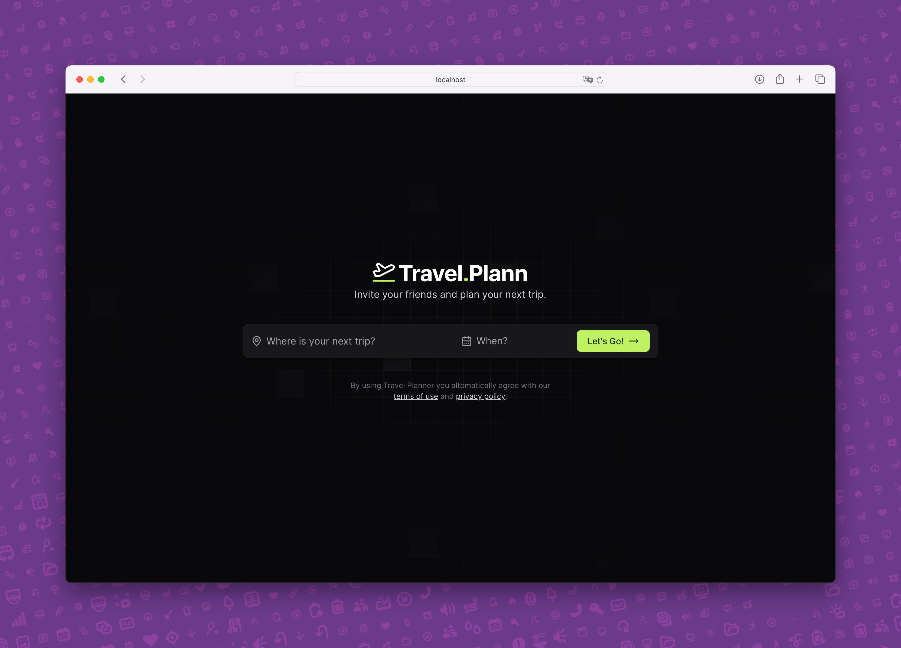

<p>
   <h1 align="center">Travel.Plann</h1>
 </p>
 
 ## 📝 About:
 This project is a travel planner where you can create a trip and invite friends to join while adding links and daily activities. It was developed during the Next Level Week Together event by Rocketseat.

https://github.com/user-attachments/assets/ef15804b-38c4-466a-9aa4-6256cfe0155b

<p align="center">
  
</p>

### 🚀 Front-end:
It uses React, TypeScript, ViteJS and TailwindCSS. The project uses Axios to make requests to the API, React Router to navigate between pages, React Day Picker to select dates, React Modal to create modal windows, React Icons to add icons, and Hero Icons to add icons.

### 🚀 Back-end
The backend uses Node.js, Express, and Prisma.

### 💻 Run this project:
```js
// Front-end:
cd frontend
npm run dev

// Back-end
cd backend
npm run dev

// Localhost
localhost:5173/
```

### 🤝 Links:
- [Fima Project](https://www.figma.com/design/GlQVSoeZBaMjxDDtLPdaCg/NLW-Journey-%E2%80%A2-Planejador-de-viagem-(Community)?node-id=3-376&t=D0tgWQZrKw10fyLw-1)
- [NLW API Docs](https://nlw-journey.apidocumentation.com/reference)
- [RocketSeat](https://www.rocketseat.com.br/assinatura)

## © Copyright:
Please note, this is a simple project as a IT student, however, it may contain some part of the code that may be Copyright. Please also note that this project is `non-profit` and not intended to be monetized.

---

<strong>Built with 💙 by [@Marcos Oliveira](https://www.linkedin.com/in/pgmarcosoliveira/)</strong>
